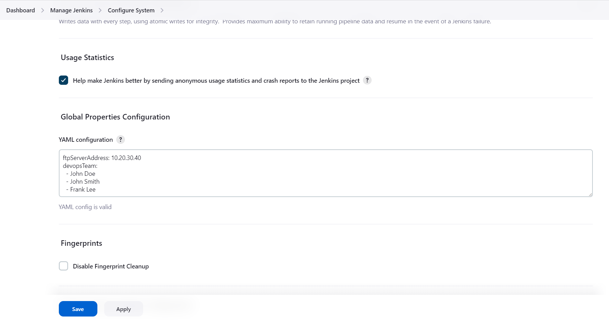
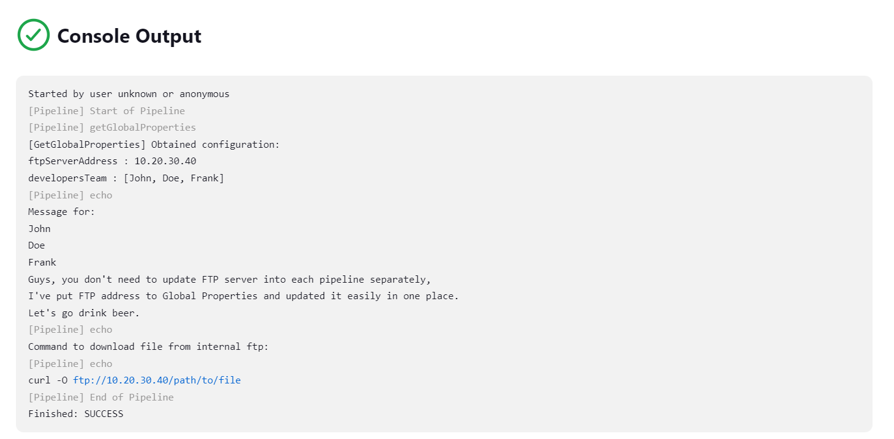
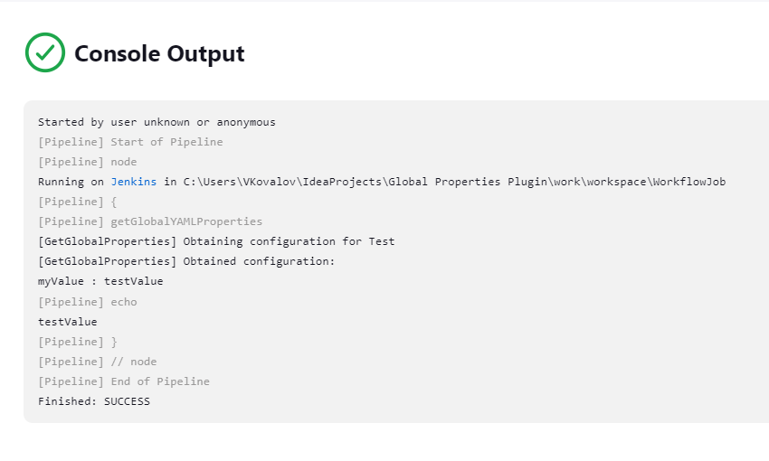

# Global YAML Properties Plugin

## Introduction

The Global YAML Properties Plugin is a universal extension for Jenkins that enhances the global configuration page by adding a custom configurations field.
This field allows users to define global properties in YAML format, which is then parsed into a HashMap and can be accessed throughout specific build step.

The plugin simplifies the management of global properties and configurations by centralizing them within Jenkins. You can define key-value pairs, nested structures, and arrays using YAML, making it easier to express complex relationships.

Once the properties are saved, they are automatically parsed into a HashMap, enabling easy access throughout your Jenkins pipelines or jobs. This promotes dynamic and customizable workflows.

With the Global YAML Properties Plugin, you can efficiently manage environment-specific variables, deployment settings, and other configurable parameters. Say goodbye to scattered configuration files and embrace streamlined configuration management within Jenkins.

### Main Goals

1. Backward compatibility for shared libraries: The Global YAML Properties Plugin aims to ensure backward compatibility for private shared libraries that contain environment-specific information such as IP addresses, ports, and other configuration details. 
By centralizing and managing these properties within the plugin, it allows for easier maintenance and updates, ensuring smooth integration with existing libraries.

2. Unify handling of actual configuration: The plugin provides a unified and centralized location to handle actual configurations used across various places within Jenkins. As configurations may change or become deprecated over time, the Global YAML Properties Plugin offers a streamlined approach to manage and update these configurations effectively. By consolidating them in one place, it promotes consistency and simplifies the configuration management process.

**Real life example:** You have self-hosted shared library that obtains toolchain from FTP to workspace and builds your product by running some commands.
Build commands and FTP address can be changed over time. Now imagine situation when you need to build old version of your product.
You have to build product using old version of shared library, where FTP address is deprecated.
Global YAML Properties Plugin allows you to define FTP address in one place and update it easily. In shred library you can just obtain value from global configuration and it will be always correct across all versions of shared library.

## Getting started
### Recommendations:
1. Think twice about configurations and format you want to put into global properties.
   If the keys and format changes frequently, this eliminates the benefit of backwards compatibility.

2. **DO NOT** put there sensitive data like passwords or tokens.
   If you need to put there some sensitive data, you can use [Credentials Plugin](https://plugins.jenkins.io/credentials/) and [Credentials Binding Plugin](https://plugins.jenkins.io/credentials-binding/) to access them in your pipeline.
   In this case global properties can be nice feature for handling credential IDs.

### Configuration
At first, define your YAML configuration in the global configuration page of Jenkins.

 Manage Jenkins -> Configure System -> Global Properties Configuration



Then, you can access the configuration in your pipeline or freestyle job.

### Usage

Step `getGlobalYAMLProperties` without arguments returns HashMap object which is parsed from default YAML configuration.
Default YAML configuration is the first configuration in the list of Global Configuration.

Here is pipeline example which explains to access the configuration:
```groovy
def myProperties = getGlobalYAMLProperties()
String message = "Message for:\n${myProperties['devopsTeam'].join('\n')}\n"
message += "Guys, you don't need to update FTP server into each pipeline separately,\n"
message += "I've put FTP address to Global Properties and updated it easily in one place.\n"
message += "Let's go drink beer."
echo message
String ftpCommand = "curl -O ftp://${myProperties.ftpServerAddress}/path/to/file"
println "Command to download file from internal ftp:"
println ftpCommand
```
Pipeline output:


Also you can use step `getGlobalYAMLProperties` with argument `name` to get specific config by name from Global Configuration.
```groovy
def myProperties = getGlobalYAMLProperties("Test")
println myProperties.myValue
```
Pipeline output:


## Issues

Report issues and enhancements in the [Jenkins issue tracker](https://issues.jenkins-ci.org/).

## Contributing

Refer to our [contribution guidelines](CONTRIBUTING.md)

## LICENSE

Licensed under MIT, see [LICENSE](LICENSE.md)

