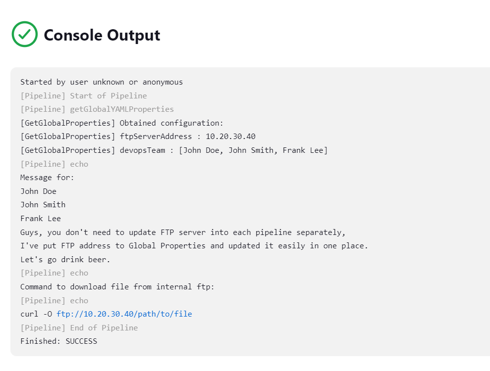

# Global Properties Plugin

## Introduction

The GlobalProperties Plugin is a universal extension for Jenkins that enhances the global configuration page by adding a custom configurations field.
This field allows users to define global properties in YAML format, which is then parsed into a HashMap and can be accessed throughout specific build step.

The plugin simplifies the management of global properties and configurations by centralizing them within Jenkins. You can define key-value pairs, nested structures, and arrays using YAML, making it easier to express complex relationships.

Once the properties are saved, they are automatically parsed into a HashMap, enabling easy access throughout your Jenkins pipelines or jobs. This promotes dynamic and customizable workflows.

With the GlobalProperties Plugin, you can efficiently manage environment-specific variables, deployment settings, and other configurable parameters. Say goodbye to scattered configuration files and embrace streamlined configuration management within Jenkins.

## Getting started

### Configuration
At first, define your YAML configuration in the global configuration page of Jenkins.

 Manage Jenkins -> Configure System -> Global Properties Configuration


Then, you can access the configuration in your pipeline or freestyle job.

### Usage

Step returns HashMap object which is parsed from YAML configuration.
Here is pipeline example which explains to access the configuration:
```groovy
def myProperties = getGlobalProperties()
String message = "Message for:\n${myProperties['devopsTeam'].join('\n')}"
message += "\nGuys, you don't need to update FTP server into each pipeline separately,"
message += "\nI've put FTP address to Global Properties and updated it easily in one place."
message += "\nLet's go drink beer."
echo message
String ftpCommand = "curl -O ftp://${myProperties.ftpServerAddress}/path/to/file"
println "Command to download file from internal ftp:"
println ftpCommand
```
Pipeline output:


## Issues

Report issues and enhancements in the [Jenkins issue tracker](https://issues.jenkins-ci.org/).

## Contributing

Refer to our [contribution guidelines](CONTRIBUTING.md)

## LICENSE

Licensed under MIT, see [LICENSE](LICENSE.md)

